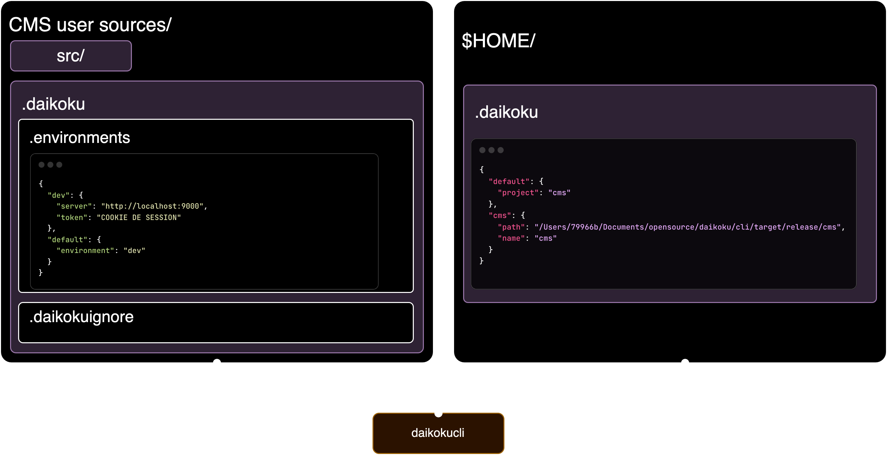

<div align="center">
  <h1><code>daikokucli</code></h1>

<strong>A <a href="https://github.com/MAIF/">MAIF</a> opensource project</strong>

  <p>
    <strong>CLI to manage your Daikoku CMS</strong>
  </p>
</div>


# Installation

This project can be installed and compiled from source with this Cargo command:

```
$ cargo install daikokucli
or
$ brew tap maif/daikokucli
$ brew install daikokucli
```

Additionally there are [precompiled artifacts built on CI][artifacts] which are
available for download as well.

[artifacts]: https://github.com/MAIF/daikoku/releases

Installation can be confirmed with:

```
$ daikokucli version
```

Subcommands can be explored with:

```
$ daikokucli help
```

# Core commands



Daikokucli uses your home folder to store the list of projects inside a `.daikoku` file. Each project created with the CLI should contain a `src` folder and a `.daikoku/.environments`. This file will contain

You can start a new project 

```sh
daikokucli create --name=<PROJECT_NAME> --path=<PROJECT_PATH_OR_CURRENT_FOLDER>
``` 

then add a default Daikoku environment  

```sh
daikokucli environments --name=<ENVIRONMENT_NAME> --server=<ENVIROMNENT_SERVER>
``` 

> The Daikoku server has to be reachable and will be checked before saving the configuration

you can start to develop and watch file changes

```sh
daikokucli watch
``` 

Common practices involve utilizing the directives within the Daikoku CMS to access private entities based on the connected user's permissions. You have the option to configure the token for accessing your CMS with an authenticated user by pasting the token from your Daikoku profile page.

```sh
daikokucli login --token=<YOUR_TOKEN>
```

If you have many environments you can switch between us simply using

```sh
daikokucli watch --environment=<NAME_OF_YOUR_ENVIRONMENT>
``` 

or permanently by changing the default project or environment

```sh
daikokucli environments default --name=<NAME_OF_YOUR_ENVIRONMENT>
daikokucli projects default --name=<NAME_OF_YOUR_PROJECT>
``` 

you can view the currently used project and the others
```sh
daikokucli projects list
``` 

At anytime, you can track an existing CMS folder or update its information
```sh
daikokucli projects add --name=<NAME_OF_YOUR_PROJECT> --path=<PATH_TO_YOUR_PROJECT> --overwrite=<true|false>
``` 

Once ready, you can synchronize your sources with the Daikoku environment
```sh
daikokucli sync
```

## Start a new project by importing an existing one

If you already have a legacy CMS on your Daikoku, you can start by importing it 
```sh
daikokucli projects import --name=<NEW_NAME_OF_YOUR_PROJECT> \
                           --path=<PATH_TO_THE_NEW_PROJECT> \
                           --server=<DAIKOKU_SERVER_TO_PULL> \
                           --token=<AUTHENTICATION_TOKEN>
```

# Manage your assets

You can manage your images, diagrams, or any type of files directly by creating a `/assets` folder inside your CMS project.

Each asset is save in the S3 of your Daikoku using the following command
```sh
daikokucli assets add --filename=<ASSET_FILENAME> \
  --path=<ONLY_NESTED_FOLDER_BEHIND_ASSETS_FOLDER> \
  --desc=<ASSET_DESCRIPTION> \
  --title=<ASSET_TITLE>
  --slug=<ASSET_SLUG>
```

If you require a particular `slug` for your asset, you have the option to replace the automatically generated one by specifying the `slug` field. Additionally, you can exclude the `path` field, which is only necessary when creating an asset from a subfolder within the `assets` directory.

To delete your asset you have to give the `filename` and the `slug` iif it differs

```sh
daikokucli assets remove --slug=<CUSTOM_SLUG> --filename=<ASSET_FILENAME>
```

As others commands, you can display all registered assets 
```sh
daikokucli assets list
```

If you prefer to synchronize all assets with a single command, it offers speed advantages over doing so individually, albeit with reduced configurability.
```sh
daikokucli assets sync
```

# License

This project is licensed under the Apache 2.0 license with the LLVM exception.

### Contribution

Unless you explicitly state otherwise, any contribution intentionally submitted
for inclusion in this project by you, as defined in the Apache-2.0 license,
shall be licensed as above, without any additional terms or conditions.