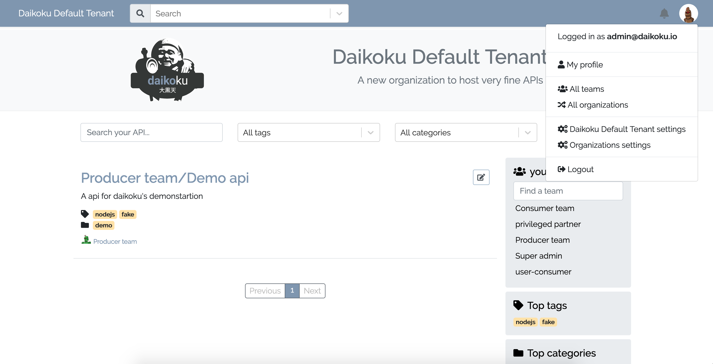

# Managing tenants

Go to `settings/Organizations settings`

@@@ div { .centered-img }

@@@

And you should see the list of existing `tenants`.

## Create a tenant

To create a new tenant, just click to the `create a new tenant` button.

### common informations

modify the name and the domain name of the tenant.
It's possible to set the default language of the tenant.

### Tenant style

Tenants could be customized in Daikoku.
Logo, title, description can be changed.
The css can be customized with some css code or js code, with overwriting css variables or with a css/js file.

### Authentication

A tenant can be be private or public. In the last case, just public api can be accessed by unauthenticated users.
Authentication can be set by choosen Local auth. or a tiers auth. like LDAP, OAuth2 or Otoroshi.
The user session duration can be set here, by default it last 24h.

### Audit trail

The settings for the output of the audit trail can be set on this page.
The output of it, in addition to writing in database, can be an elastic, a kafka or webhooks.

### Alerting
The email adresses to report some Daikoku alert.

### Mailer
The mailer type, by default just the standard output. Mailgun or Mailjet can be configure.

### Bucket
An object storage can be set to store tenant and team assets.

### Unlogged home description
The unlogged home description is the first content shown to user for private tenant, before the login page.
It can also be enable for public tenant.