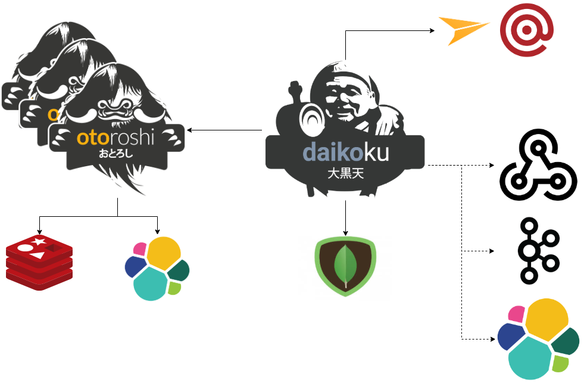

# Architecture

To make Daikoku works, you'll need an [Mongodb](https://www.mongodb.com/) datastore and an emailing provider ([Mailgun](https://www.mailgun.com/) and [Mailjet](https://www.mailjet.com/) are supported). Tou can also export the audit trail of Daikoku using many techniques with webhooks, a [Kafka](https://kafka.apache.org/) topic or an [elastic cluster](https://www.elastic.co/fr/products/elasticsearch).

As you can see, Daikoku is capable of working with many [Otoroshi](https://maif.github.io/otoroshi) cluster instances to handle all the use cases of exposing APIs. Daikoku will **never** interact directly with your APIs.

@@@ div { .centered-img }

@@@
