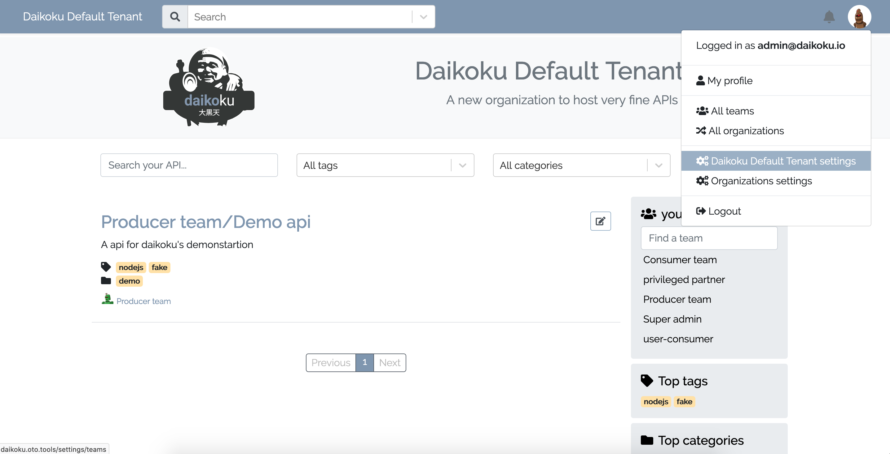
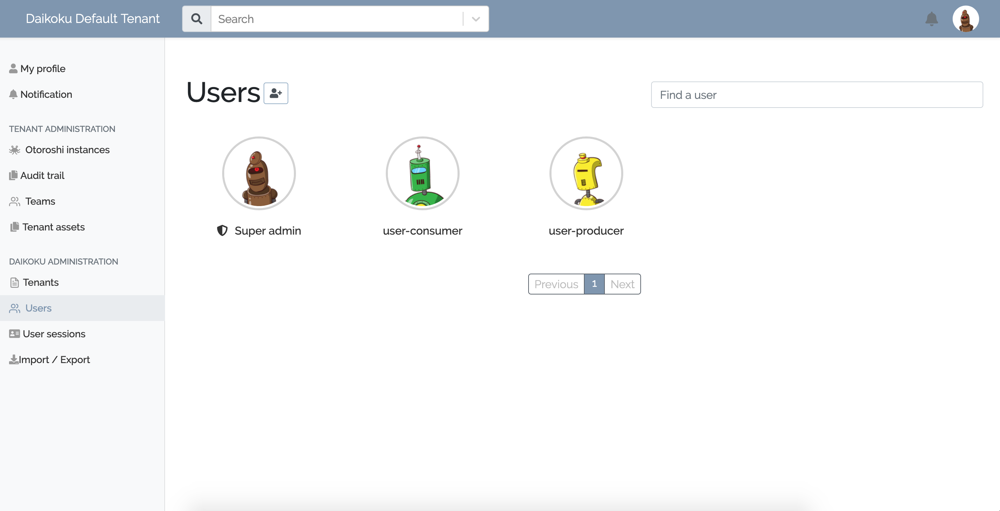
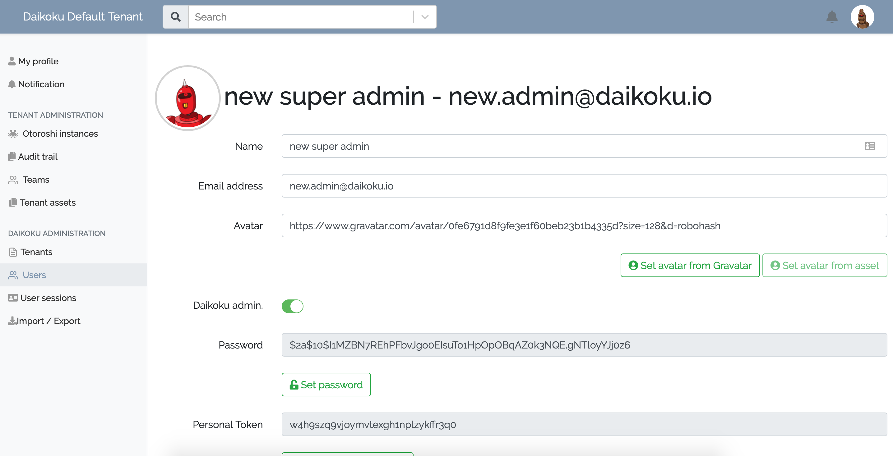

# Manage admin users

## Create admin user after the first run

After using the default super admin to the first connection to Daikoku, it can be a good idea to create a new super admin.
Go to `settings (avatar icon) / Organizations settings`.

@@@ div { .centered-img }

@@@

Go to the `Users` page, 
you will see the list of registered users : 

@@@ div { .centered-img }

@@@

Now, you can create a new user. Provide the informations about the admin user you are creating : 

@@@ div { .centered-img }

@@@

Activate `Daikoku admin.`
Click on `Create`.

Now, you can delete the initially generated `Super admin`, confirm, then logout, login with the admin user you have just created and the danger popup will go away.

## Delete admin user

Go to `settings (avatar icon) / Organizations settings / Users`, you will see a list of users that you can discard. 
Just hover the avatar and click on the `Remove User` button (trash icon) and confirm that you actually want to delete an admin user.

You may also just toggle off the admin status of the user on clicking the `toggle admin status` button (shield icon).

