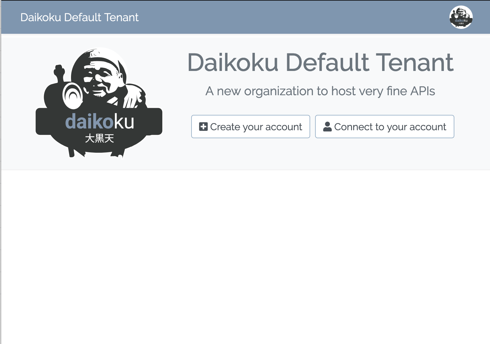
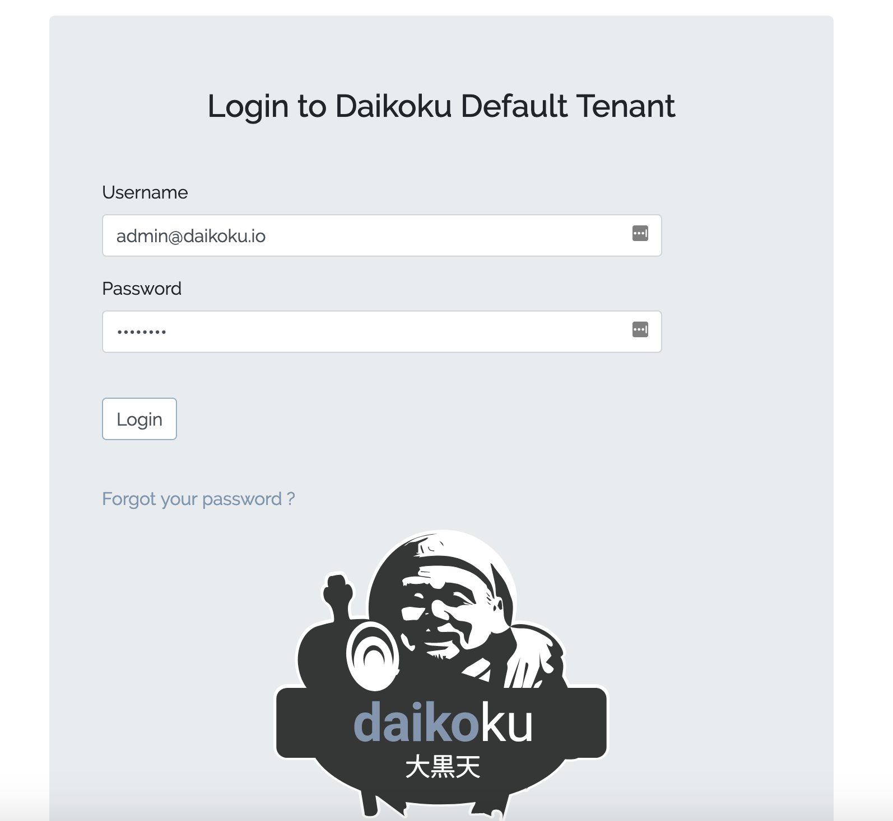
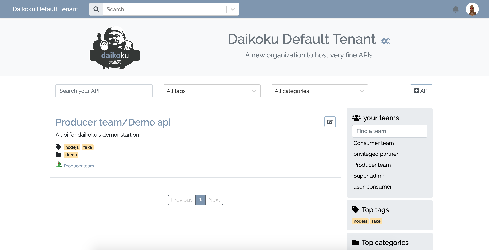

# Setup Daikoku

Now that Daikoku is running, you are ready to log into the Daikoku admin dashboard and setup your instance. Just go to :

<a href="http://daikoku.oto.tools" target="_blank">http://daikoku.oto.tools</a>

and you will see the following page
 
@@@ div { .centered-img }

@@@

now click on the login button and you will see the login page

@@@ div { .centered-img }

@@@

@@@ warning
Use the credentials generated in Daikoku **logs** during **first run**.
@@@

(of course, you can change this url dependending on the configuration you provided to Daikoku).

Once logged in, the first screen you'll see should look like :

@@@ div { .centered-img #first-login }

@@@

@@@ index

* [create admins](./admin.md)

@@@
